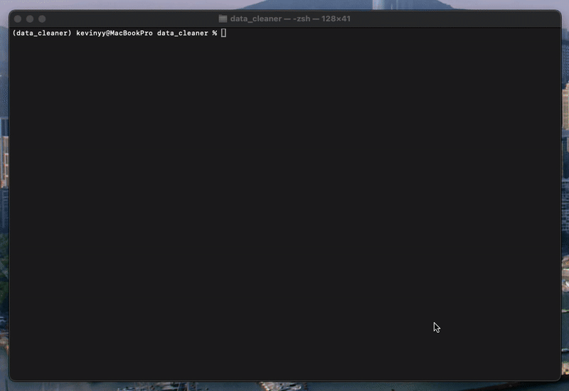

# ShipmentETL: A Python CLI for Automated Data Standardization

_Live demo of the tool in action:_



## The Problem

In the fast-paced logistics industry, data constantly arrives from various carriers, partners, and systems. This data is often inconsistent, containing a mix of formats, typos, and missing values, making it unreliable for analysis, reporting, or machine learning. Manually cleaning these files is time-consuming and prone to human error.

## The Solution

ShipmentETL is a command-line interface (CLI) tool built with Python that automates the process of cleaning and standardizing shipment data. It takes a messy CSV file as input, applies a series of predefined cleaning rules, and produces a clean, analysis-ready CSV file as output. This ensures data integrity and saves valuable analyst time.

## Key Features & Cleaning Rules

This tool automatically performs the following actions:

- ✅ **Removes Duplicate Rows:** Identifies and deletes any identical shipment records.
- ✍️ **Standardizes Text:** Cleans text fields (ports, carriers, status) by trimming whitespace and converting to a consistent uppercase format.
- 📅 **Unifies Date Formats:** Parses multiple date formats (e.g., `YYYY-MM-DD`, `MM/DD/YYYY`, `Month Day, YYYY`) and converts them to the standard `YYYY-MM-DD`.
- 💲 **Cleans Numeric Data:** Strips currency symbols (`) and commas from the `cost` column and converts it to a proper numeric type.
- 🗑️ **Handles Missing Values:** Identifies and removes rows that have critical information missing, ensuring the final dataset is complete.

## How to Use

**1. Clone the repository:**

```bash
git clone [https://github.com/kevin-yyuan/data_cleaner.git]
cd data_cleaner
```

**2. Set up the environment:**

```bash
python -m venv venv
source venv/bin/activate  # On Windows: venv\Scripts\activate
pip install -r requirements.txt
```

**3. Run the cleaner:**

```bash
python cleaner.py --input messy_shipments.csv --output clean_shipments.csv
```

## Code Spotlight

The main logic is orchestrated in the `clean_data` function, which uses the `click` library for a clean command-line interface and calls a series of modular helper functions.

```python
@click.command()
@click.option('--input', required=True, help='Path to the messy input CSV file.')
@click.option('--output', required=True, help='Path to save the clean output CSV file.')
def clean_data(input, output):
    """
    This script cleans logistics data from a CSV file.
    """
    print(f"Loading data from {input}...")
    df = pd.read_csv(input)

    print("\n--- Starting Cleaning Process ---")

    # 1. Remove duplicate rows
    initial_rows = len(df)
    df_clean = remove_duplicates(df)
    print(f"Removed {initial_rows - len(df_clean)} duplicate rows.")

    # 2. Clean text fields
    text_cols = ['origin_port', 'destination_port', 'carrier', 'status']
    df_clean = clean_text(df_clean, text_cols)
    print(f"Cleaned and standardized text columns: {text_cols}")

    # 3. Standardize date formats
    date_cols = ['departure_date', 'arrival_date']
    df_clean = standardize_dates(df_clean, date_cols)
    print(f"Standardized date columns: {date_cols}")

    # 4. Clean the cost column
    df_clean = clean_cost(df_clean, 'cost')
    print("Cleaned cost column to numeric format.")

    # 5. Handle missing values (simple strategy: drop rows with any missing data)
    initial_rows = len(df_clean)
    df_clean = df_clean.dropna()
    print(f"Dropped {initial_rows - len(df_clean)} rows with missing values.")

    print("\n--- Cleaning Complete ---")
    print("\nFinal clean data sample:")
    print(df_clean.head())

    # Save the cleaned data
    df_clean.to_csv(output, index=False)
    print(f"\n✅ Success! Clean data saved to {output}")
    print(f"Total rows in clean file: {len(df_clean)}")
```

## Tech Stack

- **Language:** Python
- **Libraries:** Pandas, Click

## License

This project is licensed under the MIT License. See the [LICENSE](LICENSE) file for details.

## Contributing

Contributions are welcome! If you have ideas for new features, improvements, or bug fixes, please open an issue or submit a pull request.
